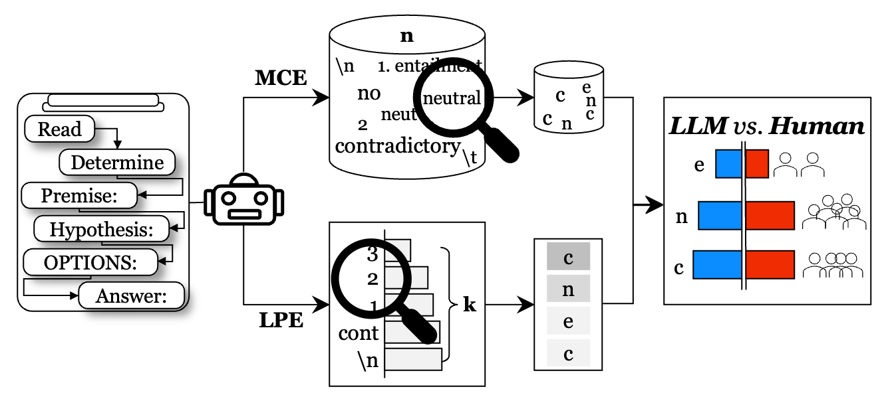

# Can Large Language Models Capture Dissenting Human Voices? (EMNLP 2023)

Authors: [Noah Lee](https://nlee-208.github.io/)*
[Na Min An](https://namin-an.github.io/)*
[James Thorne](https://jamesthorne.com/)


- We test generative LLMs jointly on the performance and human disagreement on NLI.
- We suggest two probability distribution estimation techniques for LLMs to represent disagreement and perform empirical evaluations to with respect to the human disagreement distribution.
- LLMs do not excel as expected on NLI tasks and fail to align with human disagreement levels.

<br>

 <a href="https://arxiv.org/abs/2305.13788"></a>

<p align="center" width="100%"></img></p>   


<br>


## Environment Setting
```
conda create -n humllm
conda activate humllm
pip install -r requirements.txt
```

<br>

## Datasets
The datasets used for the research are as the following:
- [ChaosNLI](https://www.dropbox.com/s/h4j7dqszmpt2679/chaosNLI_v1.0.zip)
- [QNLI](https://huggingface.co/datasets/glue)
- [ANLI](https://github.com/facebookresearch/anli)
- [PK2019](https://github.com/epavlick/NLI-variation-data/blob/master/sentence-pair-analysis/preprocessed-data.jsonl)
- [NLI_Disagreement](https://github.com/njjiang/NLI_disagreement_taxonomy/blob/main/taxonomy_annotations/taxonomy_round1_release.jsonl)


<br>

## Usage
- All the script examples can be found in `./scripts/`

### Preprocess & Sample
Sample random 100 samples & hardest 100 samples
```
bash ./scripts/sample.sh
```

### Generate
Generation of a LLM output can be done by `bash ./scripts/generate.sh` or either:
```
python generate.py --data_dir <input data directory> \
                    --data_type <input data type> \
                    --model <model name> \
                    --file_name <output file name> \
                    --out_dir <output directory> \
                    --max_length <maximum token lengths> \
                    --gen_type <generation type> \
                    --num_iter <iteration number> \ 
                    --num_samples <sample number> # num_iter x num_samples = total sample size \
                    --prompt_variations <use prompt variations> \
                    --few_shot <few shot number>
```

### Evaluate
Evaluation of generated distribution is available by `bash ./scripts/evaluate.sh` or either:
```
python evaluate.py --data_dir <input data directory> \
                    --data_type <input data type> \
                    --gen_type <generation type>
```


## Citation
Please consider citing our work if you find this work helpful for your research.

```
@misc{lee2023large,
      title={Can Large Language Models Capture Dissenting Human Voices?}, 
      author={Noah Lee and Na Min An and James Thorne},
      year={2023},
      eprint={2305.13788},
      archivePrefix={arXiv},
      primaryClass={cs.CL}
}
```

## Contact
- Noah Lee: noah.lee@kaist.ac.kr
- Na Min An: naminan@kaist.ac.kr